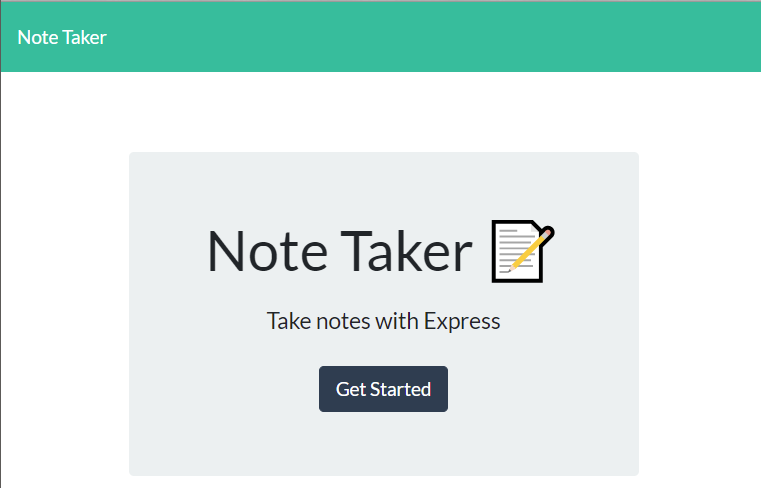
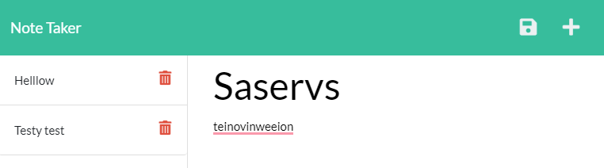

# Simple Notes

A note taking application built with an Express backend for API calls

Deployment - <https://ashleys-simple-notes.herokuapp.com/>

## Table of Contents

[Installation](#installation)

[Examples](#examples)

## Installation

Clone the repo

```termnal
git clone https://github.com/minusInfinite/simple-notes.git
cd /simple-notes
```

This application uses the package manager Yarn - https://yarnpkg.com/
You may need to insure Yarn Classic is installed globally beforehand

```termnal
npm install -g yarn
yarn install
```

## Local Server

To start the local express server run one of the following scripts

```termnal
yarn start -- to start the server with node
yarn dev -- to start the server with nodemon
```

## Examples

An example of the landing page


An example of the page Notes are written


## Credits

express - https://expressjs.com/
